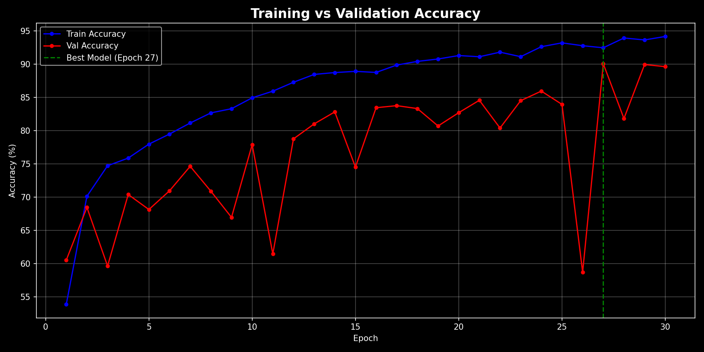
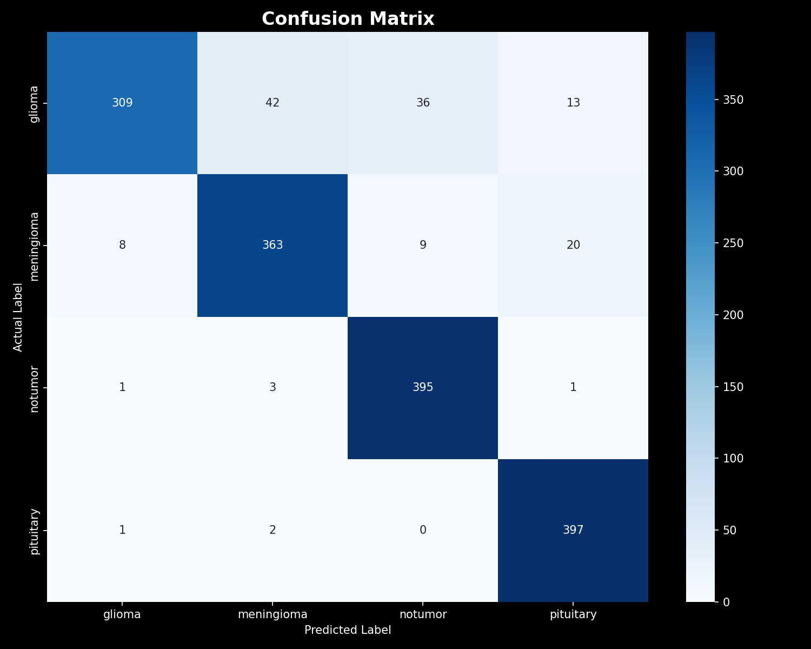
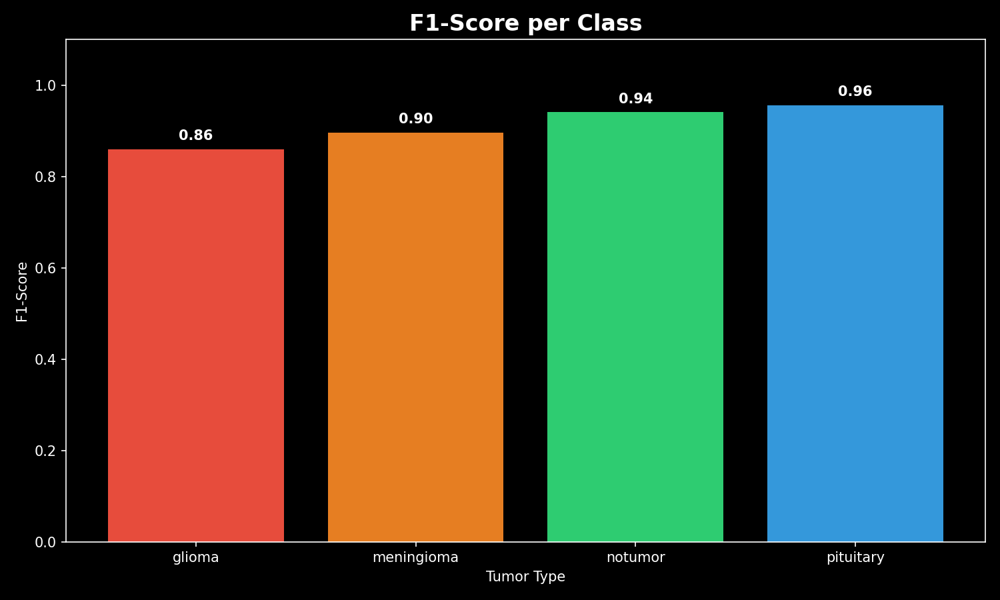

# 🧠 Brain Tumor Classification using Deep Learning

<div align="center">


*A deep learning model that classifies brain MRI scans into 4 tumor categories with **91.5% accuracy**.*

</div>

---

## 📌 Overview

This project applies Convolutional Neural Networks (CNNs) to classify brain MRI images into one of four categories:

- 🔴 **Glioma** — malignant tumors arising from glial cells
- 🟠 **Meningioma** — tumors forming on the brain's protective membranes
- 🟢 **No Tumor** — healthy brain scan
- 🔵 **Pituitary** — tumors located in the pituitary gland

Early and accurate detection of brain tumors can be life-saving. This model assists in automating the classification step, reducing diagnostic time and human error.

---

## 📊 Results

### ✅ Overall Accuracy: **91.5%**

### 📋 Classification Report

| Class        | Precision | Recall | F1-Score | Support |
|--------------|-----------|--------|----------|---------|
| Glioma       | 0.97      | 0.77   | 0.86     | 400     |
| Meningioma   | 0.89      | 0.91   | 0.90     | 400     |
| No Tumor     | 0.90      | 0.99   | 0.94     | 400     |
| Pituitary    | 0.92      | 0.99   | 0.96     | 400     |
| **Macro Avg**    | **0.92**  | **0.92** | **0.91** | **1600** |
| **Weighted Avg** | **0.92**  | **0.92** | **0.91** | **1600** |

### 🔍 Key Observations

- **Pituitary tumors** achieved the best F1-score (0.96), with near-perfect recall (0.99)
- **No Tumor** class has excellent recall (0.99), meaning the model almost never misses a healthy scan
- **Glioma** has the highest precision (0.97) but lower recall (0.77) — the model is very confident when it does predict glioma, but misses some cases
- **Meningioma** is the most challenging class, which is consistent with literature due to its visual similarity to other tumor types

---

## 🖼️ Visualizations

| Training Curve | Confusion Matrix | F1 Scores |
|:--------------:|:----------------:|:---------:|
|  |  |  |

---

## 🗂️ Dataset

- **Source:** [Brain Tumor MRI Dataset — Kaggle](https://www.kaggle.com/datasets/masoudnickparvar/brain-tumor-mri-dataset)
- **Classes:** Glioma, Meningioma, No Tumor, Pituitary
- **Total Test Samples:** 1,600 (400 per class — perfectly balanced)

---

## 🛠️ Tech Stack

| Tool | Purpose |
|------|---------|
| Python | Core language |
| PyTorch | Model training & inference |
| torchvision | Image transforms & pretrained models |
| NumPy / Pandas | Data handling |
| Matplotlib / Seaborn | Visualization |
| scikit-learn | Metrics & evaluation |
| Google Colab | Training environment |

---

## 🚀 Getting Started

### 1. Clone the repo
```bash
git clone https://github.com/JainishKumar12/Brain-tumor-classification.git
cd Brain-tumor-classification
```

### 2. Install dependencies
```bash
pip install torch torchvision matplotlib seaborn scikit-learn pandas numpy
```

### 3. Download the dataset
Download from [Kaggle](https://www.kaggle.com/datasets/masoudnickparvar/brain-tumor-mri-dataset) and place it in the project root.

### 4. Run the notebook
Open `brain_tumor.ipynb` in Jupyter or Google Colab and run all cells.

---

## 📁 Project Structure

```
Brain-tumor-classification/
│
├── brain_tumor.ipynb         # Main training & evaluation notebook
├── best_modeltumor.pth       # Saved best model weights (not tracked in git)
├── confusion_matrix.png      # Confusion matrix visualization
├── training_curve.png        # Training & validation loss/accuracy curves
├── f1_scores.png             # Per-class F1 score chart
└── README.md                 # Project documentation
```

---

## 🧪 Model Architecture

The model is based on a **pretrained CNN backbone** fine-tuned on brain MRI data, leveraging transfer learning for improved performance on the relatively small medical dataset.

Key training details:
- **Loss Function:** Cross-Entropy Loss
- **Optimizer:** Adam
- **Data Augmentation:** Random flips, rotations, normalization
- **Early Stopping:** Best model saved based on validation accuracy

---

## 📈 Future Improvements

- [ ] Grad-CAM visualizations to highlight tumor regions
- [ ] Experiment with EfficientNet / Vision Transformer (ViT)
- [ ] Deploy as a web app using Streamlit or Flask
- [ ] Expand dataset with additional augmentation techniques
- [ ] Ensemble multiple models for higher accuracy

---

## 🙏 Acknowledgements

- Dataset by [Masoud Nickparvar](https://www.kaggle.com/masoudnickparvar) on Kaggle
- Inspired by the need for accessible, fast diagnostic tools in healthcare

---

<div align="center">

Made with ❤️ by [Jainish Kumar](https://github.com/JainishKumar12)

*If you found this helpful, please ⭐ star the repository!*

</div>
